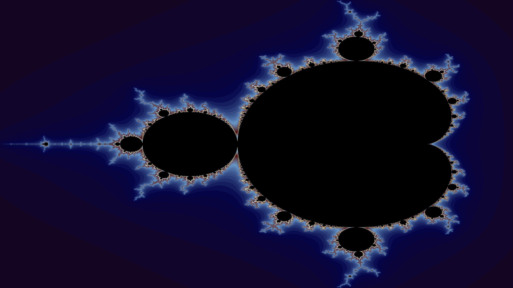

# Fractal-rs

 

**Fractal-rs** is a fractal visualization tool crafted in Rust, designed to generate a wide array of complex and beautiful fractals. Using [Rust](<https://en.wikipedia.org/wiki/Rust_(programming_language)>) along with [Rayon](https://docs.rs/rayon/latest/rayon), enabling it to produce high-resolution images of various fractal patterns. The tool offers configurable color gradients and a diverse selection of fractal generation algorithms, combining performance with visual versatility.

## Fractals

| Fractal        | Description                                                                                                  | Resources                                                                                                                 |
| -------------- | ------------------------------------------------------------------------------------------------------------ | ------------------------------------------------------------------------------------------------------------------------- |
| Mandelbrot Set | A set of complex numbers for which the function $f(z) = z^2 + c$ does not diverge when iterated from $z = 0$ | [Wikipedia](https://en.wikipedia.org/wiki/Mandelbrot_set), [Paul Bourke](https://paulbourke.net/fractals/mandelbrot)      |
| Julia Set      | A set of complex numbers for which the function $f(z) = z^2 + c$ does not diverge when iterated from $z = c$ | [Wikipedia](https://en.wikipedia.org/wiki/Julia_set), [Paul Bourke](https://paulbourke.net/fractals/juliaset)             |
| Burning Ship   | A variant of the Mandelbrot set, with the function $f(z) = (\| Re(z) \| + i \| Im(z) \| )^2 + c$             | [Wikipedia](https://en.wikipedia.org/wiki/Burning_Ship_fractal), [Paul Bourke](https://paulbourke.net/fractals/burnship)  |
| Lyapunov       | A fractal based on the logistic map $x_{n+1} = r x_n (1 - x_n)$                                              | [Wikipedia](https://en.wikipedia.org/wiki/Lyapunov_fractal), [Paul Bourke](https://paulbourke.net/fractals/lyapunov)      |
| Newton Raphson | A fractal based on Newton's method for finding roots of a function                                           | [Wikipedia](https://en.wikipedia.org/wiki/Newton_fractal), [Paul Bourke](https://paulbourke.net/fractals/newtonraphson)   |
| Sierpiński     | A fractal based on the Sierpiński triangle                                                                   | [Wikipedia](https://en.wikipedia.org/wiki/Sierpiński_triangle), [Paul Bourke](https://paulbourke.net/fractals/polyhedral) |
| Koch Snowflake | A fractal based on the Koch curve                                                                            | [Wikipedia](https://en.wikipedia.org/wiki/Koch_snowflake)                                                                 |
| Dragon Curve   | A fractal based on the Heighway dragon curve                                                                 | [Wikipedia](https://en.wikipedia.org/wiki/Dragon_curve)                                                                   |
| L-Systems      | A fractal based on Lindenmayer systems                                                                       | [Wikipedia](https://en.wikipedia.org/wiki/L-system), [Paul Bourke](https://paulbourke.net/fractals/lsys)                  |

## References

-   Fractals [Wikipedia](https://en.wikipedia.org/wiki/Fractal)
-   Paul Bourke [Fractals](https://paulbourke.net/fractals/)
